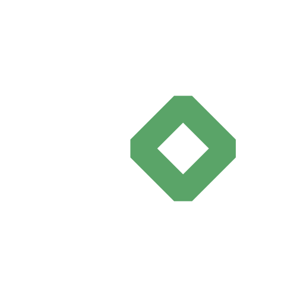
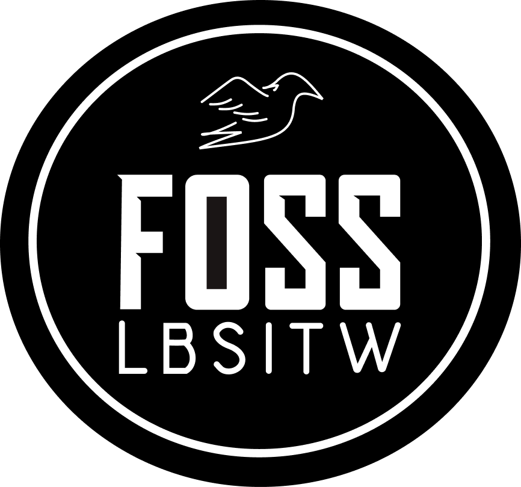

  <picture>
    <source media="(prefers-color-scheme: dark)" srcset="logo/logo-dark-clr.svg">
    <source media="(prefers-color-scheme: light)" srcset="logo/logo-light-clr.svg">
    
  </picture>

  <h3>The Ultimate Open Source Challenge</h3>

  

    A month-long, beginner-friendly Free and Open Source Software (FOSS) contribution program.
  

  
  

    
    
  

   

  

    <a href="#about-the-initiative">About</a> •
    <a href="#event-details">Details</a> •
    <a href="#platform-architecture">Architecture</a> •
    <a href="#organizers">Organizers</a>
  

---

## About the Initiative

**Commit Overflow** is designed to bridge the gap between classroom learning and real-world software development by helping students become confident, long-term contributors to the open-source ecosystem. 

Through structured mentorship, hands-on learning, and guided collaboration, the program equips students with the skills required to make meaningful contributions to real-world open-source projects.

### Event Highlights
- **Beginner Friendly:** Tailored for first-timers to get started with FOSS.
- **Mentor Guided:** Receive reviews, guidance, and feedback from experienced mentors.
- **Real FOSS Projects:** Contribute to actual repositories, not just sandbox environments.
- **Live Dashboard:** Track progress and leaderboard rankings in real-time.
- **GitHub Workflow:** Learn standard industry practices.

### Participants Will:
- Explore real open-source repositories.
- Identify and raise issues.
- Implement solutions through pull requests.
- Receive mentor reviews and feedback.
- Gain practical experience with Git, GitHub, GitLab, collaborative development, and OSS contribution.

### Target Audience
- Students interested in open source.
- First-time FOSS contributors.
- Experienced developers looking to contribute.

## Event Details

| Category | Details |
| :--- | :--- |
| **Duration** | 1 Week + 1 Month |
| **Mode** | Online |
| **Cost** | Free |
| **Platform** | GitHub & GitLab |
| **Organizers** | FOSS CEAL + LBSITW FOSS Club |

## Platform Architecture

This repository houses the frontend codebase for the Commit Overflow platform—the central hub where participants register, track their progress, and compete.

Built with a focus on performance and a unique hacker-themed aesthetic, the application intentionally avoids heavy frameworks in favor of a bespoke vanilla stack.

### Key Features
- **Participant Dashboard:** Real-time tracking of personal PRs and issues.
- **Dynamic Leaderboard:** Live scoring and ranking system to fuel the competition.
- **Resource Hub:** Centralized rules, guidelines, and curated repository lists.

### Tech Stack
- **Core:** Semantic `HTML5`, modern `CSS3`, and `Vanilla JavaScript`.
- **System:** Custom component-based architecture (`components.js` & `components.css`).
- **Aesthetics:** Terminal/Hacker-themed visual effects including ASCII ripples and text decryption animations.
- **Assets:** Typography powered by *Inter*, icons via *Phosphor Icons*.

## Organizers

Commit Overflow is made possible through the collaboration of student-led communities dedicated to promoting open-source technologies.

   
  <table>
    <tr>
      <td align="center" width="250">
        
      </td>
      <td align="center" width="250">
        
      </td>
    </tr>
    <tr>
      <td align="center">
        <strong><a href="https://foss.ceal.in" style="text-decoration:none; color:inherit;">FOSS CEAL</a></strong> 
        <em>College of Engineering Attingal</em>
      </td>
      <td align="center">
        <strong><a href="https://fossclub-lbsitw.github.io/FOSS-WEBSITE/" style="text-decoration:none; color:inherit;">LBSITW FOSS CLUB</a></strong> 
        <em>LBS Institute of Technology for Women</em>
      </td>
    </tr>
  </table>

## Funding & Sponsorships

Operating the platform and rewarding our top contributors requires community support. Detailed information regarding our financial needs, infrastructure costs, and plans for contributor prize money can be found in the [`funding.json`](./funding.json) manifest.

## License

Distributed under the **GNU General Public License v3.0**. See the [`LICENSE`](./LICENSE) file for more information.
